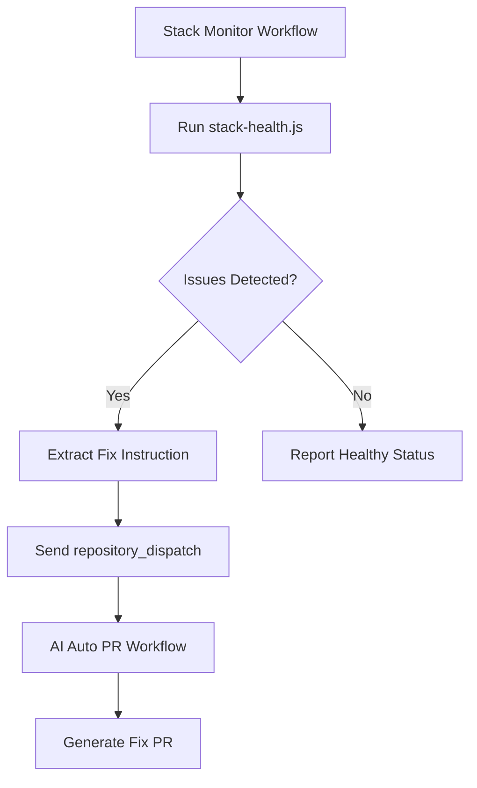

# Stack Monitor Implementation

This document describes the stack monitoring system that automatically triggers the AI Auto PR workflow when configuration or build issues are detected.

## Overview

The implementation consists of three main components:

1. **Stack Health Monitor Script** (`scripts/stack-health.js`)
2. **Stack Monitor Workflow** (`.github/workflows/stack-monitor.yml`)
3. **Enhanced AI Auto PR Workflow** (`.github/workflows/ai-autopr.yml`)

## How It Works

### 1. Stack Health Monitor Script

The script performs the following checks:

- **Environment Variables**: Verifies that required Supabase environment variables are present
  - `NEXT_PUBLIC_SUPABASE_URL`
  - `NEXT_PUBLIC_SUPABASE_ANON_KEY`

- **Next.js Build**: Attempts to build the frontend to detect compilation issues

- **Supabase Configuration**: Checks for proper Supabase client setup in the lib/ directory

- **Health Endpoint**: Verifies that a health endpoint exists at `/api/health`

#### Exit Codes
- `0`: All checks passed
- `1`: Environment configuration issues
- `2`: Build failures
- `3`: Supabase connectivity issues
- `4`: Health endpoint issues

#### Example Output
When issues are detected, the script outputs a structured fix instruction:

```
---FIX-INSTRUCTION---
Fix detected stack issues: ensure NEXT_PUBLIC_SUPABASE_URL/ANON_KEY are properly configured and read only on client; fix Next.js build errors; move Supabase init out of build-time; fix Supabase client configuration
---END-FIX-INSTRUCTION---
```

### 2. Stack Monitor Workflow

- **Schedule**: Runs every hour (`0 * * * *`)
- **Manual Trigger**: Can be triggered manually with option to force fix
- **Actions**: 
  1. Runs the stack health check script
  2. Captures exit code and output
  3. Extracts fix instruction if issues are detected
  4. Triggers AI Auto PR workflow via `repository_dispatch` if needed

### 3. Enhanced AI Auto PR Workflow

The existing AI Auto PR workflow has been enhanced to:

- Accept `repository_dispatch` events with type `stack-health-fix`
- Handle instructions from the stack monitor
- Include additional context like error type and trigger source

## Integration Flow



## Example Trigger Scenarios

### Missing Environment Variables
**Detection**: Required Supabase environment variables not found
**Instruction**: "Fix detected stack issues: ensure NEXT_PUBLIC_SUPABASE_URL/ANON_KEY are properly configured and read only on client"

### Build Failure
**Detection**: Next.js build fails during compilation or page data collection
**Instruction**: "Fix detected stack issues: fix Next.js build errors; move Supabase init out of build-time"

### Supabase Configuration Issues
**Detection**: Supabase client configuration files missing or malformed
**Instruction**: "Fix detected stack issues: fix Supabase client configuration"

### Missing Health Endpoint
**Detection**: No health endpoint found at expected locations
**Instruction**: "Fix detected stack issues: add health route at /api/health"

## Testing

To test the implementation:

```bash
# Test stack health check
./scripts/stack-health.js

# Test with environment variables
NEXT_PUBLIC_SUPABASE_URL=https://test.supabase.co \
NEXT_PUBLIC_SUPABASE_ANON_KEY=test_key \
./scripts/stack-health.js

# Validate workflow syntax
yamllint .github/workflows/stack-monitor.yml
```

## Configuration

The stack monitor can be configured by:

- Modifying the schedule in `stack-monitor.yml`
- Adjusting the required environment variables in `stack-health.js`
- Customizing the fix instructions based on detected issues
- Adding additional health checks to the script

## Security Considerations

- The stack monitor only reads configuration, it doesn't modify anything
- Environment variables are checked by name only, values are not logged
- Fix instructions are generated based on detected issue patterns
- All triggers use GitHub's secure `repository_dispatch` mechanism