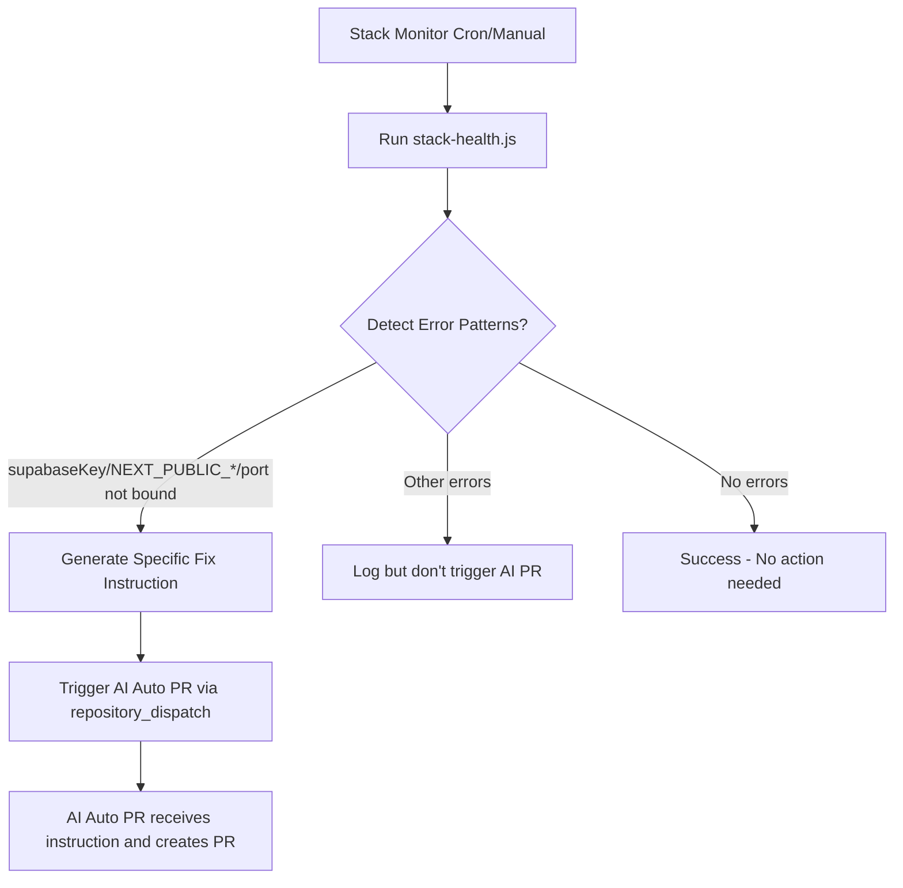

# Stack Monitor AI Auto PR Integration

## Overview

The Stack Monitor workflow has been updated to detect specific code/configuration issues and automatically trigger the AI Auto PR workflow with targeted fix instructions.

## Changes Made

### 1. Enhanced Error Detection in `scripts/stack-health.js`

The stack health script now detects specific error patterns mentioned in the requirements:

- **`supabaseKey is required`** - Detects when Supabase client initialization fails, particularly when server-side environment variables are used instead of client-side `NEXT_PUBLIC_*` variables
- **`NEXT_PUBLIC_* missing`** - Detects missing or misconfigured Next.js public environment variables
- **`port not bound`** - Detects Railway deployment issues including missing Dockerfile or improper port configuration

### 2. Targeted Fix Instruction Generation

When any of the above patterns are detected, the script generates the specific fix instruction:

```
Fix Next build/Supabase init: move Supabase client to client-only, ensure NEXT_PUBLIC_SUPABASE_* used only in browser, add /api/health, and adjust Dockerfile for Railway standalone.
```

### 3. Updated Workflow Logic in `.github/workflows/stack-monitor.yml`

The workflow now:

1. **Enhanced Pattern Detection**: Checks for the specific error patterns in the health check output
2. **Conditional AI Auto PR Trigger**: Only triggers the AI Auto PR workflow when code/config issues are detected
3. **Improved Error Classification**: Adds a new `code_config` error type for the specific patterns
4. **Repository Dispatch**: Uses `peter-evans/repository-dispatch@v3` to trigger the AI Auto PR workflow with the targeted instruction

## Error Detection Logic

The system uses a priority-based approach for exit codes:

- **Exit Code 0**: All checks passed
- **Exit Code 1**: Environment configuration issues (highest priority)
- **Exit Code 2**: Next.js build failures
- **Exit Code 3**: Supabase configuration issues
- **Exit Code 4**: Health endpoint missing
- **Exit Code 5**: Railway configuration issues

## Workflow Integration



## Configuration

The workflow uses the following GitHub Actions permissions:
- `contents: read` - To check out the repository
- `actions: write` - To trigger other workflows via repository_dispatch
- `issues: write` - For potential issue creation/updates

## Testing

The implementation includes comprehensive test scenarios that validate:

1. Detection of missing `NEXT_PUBLIC_*` environment variables
2. Detection of Supabase client configuration issues
3. Detection of Railway/Dockerfile port binding issues
4. Proper fix instruction generation
5. Correct exit code handling

## Usage

The Stack Monitor runs automatically every hour via cron schedule, or can be triggered manually with the option to force AI Auto PR execution even without detected issues.

When code/configuration issues are detected, the workflow will automatically dispatch the AI Auto PR workflow with the specific fix instruction, enabling automated remediation of common configuration problems.